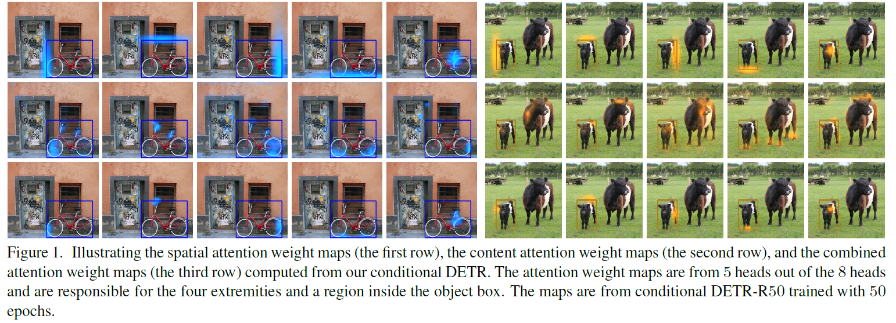
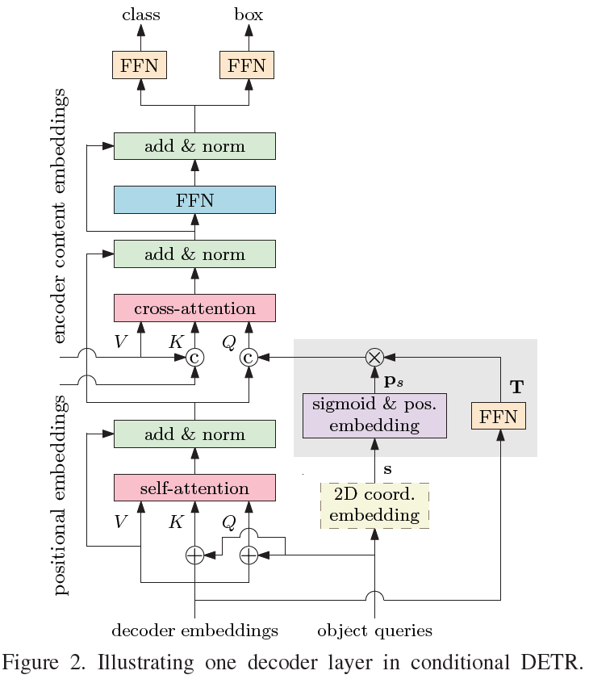
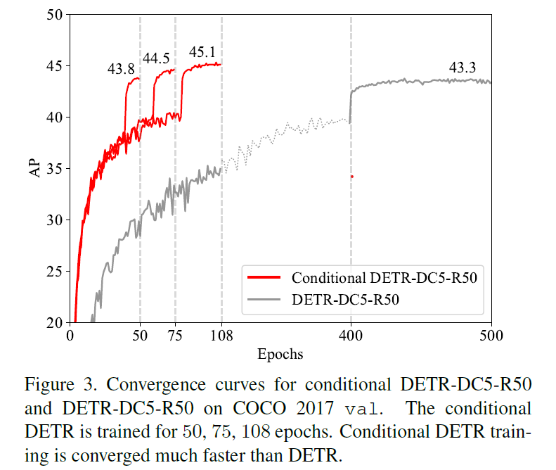

# Conditional DETR

This repository is an official implementation of the ICCV 2021 paper "[Conditional DETR for Fast Training Convergence](https://arxiv.org/abs/2108.06152)". 

* Conditional DETR is integrated in [Huggingface](https://huggingface.co/docs/transformers/main/en/model_doc/conditional_detr), try out our model [here](https://huggingface.co/microsoft/conditional-detr-resnet-50). 

## Introduction

The DETR approach applies the
transformer encoder and decoder architecture to object detection
and achieves promising performance. In this paper,
we handle the critical issue, slow training convergence,
and present a conditional cross-attention mechanism for
fast DETR training. Our approach is motivated by that <b>the
cross-attention in DETR relies highly on the content embeddings
and that the spatial embeddings make minor contributions</b>,
increasing the need for high-quality content embeddings
and thus increasing the training difficulty.

<div align=center>  

</div>

Our conditional DETR learns a conditional
spatial query from the decoder embedding
for decoder multi-head cross-attention.
The benefit is that through the conditional spatial query,
each cross-attention head is able to 
<b>attend
to a band containing a distinct region,
e.g., one object extremity or a region inside the object box </b> (Figure 1).
This narrows down the spatial range for localizing the distinct regions
for object classification and box regression,
thus relaxing the dependence on the content embeddings and
easing the training. Empirical results show that conditional
DETR converges 6.7x faster for the backbones R50 and
R101 and 10x faster for stronger backbones DC5-R50 and
DC5-R101.

<div align=center>  

  
</div>


## Model Zoo

We provide conditional DETR and conditional DETR-DC5 models.
AP is computed on COCO 2017 *val*.

<table>
  <thead>
    <tr style="text-align: right;">
      <th>Method</th>
      <th>Epochs</th>
      <th>Params (M)</th>
      <th>FLOPs (G)</th>
      <th>AP</th>
      <th>AP<sub>S</sub></th>
      <th>AP<sub>M</sub></th>
      <th>AP<sub>L</sub></th>
      <th>URL</th>
    </tr>
  </thead>
  <tbody>
    <tr>
      <td>DETR-R50</td>
      <td>500</td>
      <td>41</td>
      <td>86</td>
      <td>42.0</td>
      <td>20.5</td>
      <td>45.8</td>
      <td>61.1</td>
      <td><a href="https://dl.fbaipublicfiles.com/detr/detr-r50-e632da11.pth">model</a> <br/> <a href="https://dl.fbaipublicfiles.com/detr/logs/detr-r50_log.txt">log</a></td>
    </tr>
    <tr>
      <td>DETR-R50</td>
      <td>50</td>
      <td>41</td>
      <td>86</td>
      <td>34.8</td>
      <td>13.9</td>
      <td>37.3</td>
      <td>54.4</td>
      <td><a href="https://pkueducn-my.sharepoint.com/:u:/g/personal/pkucxk_pkueducn_onmicrosoft_com/EWH1OGLL4N5DufAj4ncYuigB8q62uEw6I10G-d7OD7q09A?e=vKOlb6">model</a> <br/> <a href="https://pkueducn-my.sharepoint.com/:t:/g/personal/pkucxk_pkueducn_onmicrosoft_com/EdkDyyp9TvZIh813TR-Z4oYBYb-BfjHrsH66vqiX4IvdFA?e=u1aRcM">log</a></td>
    </tr>
    <tr>
      <td>DETR-DC5-R50</td>
      <td>500</td>
      <td>41</td>
      <td>187</td>
      <td>43.3</td>
      <td>22.5</td>
      <td>47.3</td>
      <td>61.1</td>
      <td><a href="https://dl.fbaipublicfiles.com/detr/detr-r50-dc5-f0fb7ef5.pth">model</a> <br/> <a href="https://dl.fbaipublicfiles.com/detr/logs/detr-r50-dc5_log.txt">log</a></td>
    </tr>
    <tr>
      <td>DETR-R101</td>
      <td>500</td>
      <td>60</td>
      <td>152</td>
      <td>43.5</td>
      <td>21.0</td>
      <td>48.0</td>
      <td>61.8</td>
      <td><a href="https://dl.fbaipublicfiles.com/detr/detr-r101-2c7b67e5.pth">model</a> <br/> <a href="https://dl.fbaipublicfiles.com/detr/logs/detr-r101_log.txt">log</a></td>
    </tr>
    <tr>
      <td>DETR-R101</td>
      <td>50</td>
      <td>60</td>
      <td>152</td>
      <td>36.9</td>
      <td>15.5</td>
      <td>40.6</td>
      <td>55.6</td>
      <td><a href="https://pkueducn-my.sharepoint.com/:u:/g/personal/pkucxk_pkueducn_onmicrosoft_com/EaGY26sT-zhPtMIVZxeT8iEBjiN24_LDZPXb8EGi9dBXpw?e=p6C8dB">model</a> <br/> <a href="https://pkueducn-my.sharepoint.com/:t:/g/personal/pkucxk_pkueducn_onmicrosoft_com/EbyeU-QcHL1PgCM1CCb4Y_8BWp02J27M3Kuf7lfOAzS-qQ?e=e1Dp5n">log</a></td>
    </tr>
    <tr>
      <td>DETR-DC5-R101</td>
      <td>500</td>
      <td>60</td>
      <td>253</td>
      <td>44.9</td>
      <td>23.7</td>
      <td>49.5</td>
      <td>62.3</td>
      <td><a href="https://dl.fbaipublicfiles.com/detr/detr-r101-dc5-a2e86def.pth">model</a> <br/> <a href="https://dl.fbaipublicfiles.com/detr/logs/detr-r101-dc5_log.txt">log</a></td>
    </tr>
    <tr>
      <td><b>Conditional DETR-R50</b></td>
      <td>50</td>
      <td>44</td>
      <td>90</td>
      <td>41.0</td>
      <td>20.6</td>
      <td>44.3</td>
      <td>59.3</td>
      <td><a href="https://pkueducn-my.sharepoint.com/:u:/g/personal/pkucxk_pkueducn_onmicrosoft_com/EXaUwp6Qt29Mub0bVOExLusBlyqqyO7qCIQfVWclbOGulw?e=ILR0sI">model</a> <br/> <a href="https://pkueducn-my.sharepoint.com/:t:/g/personal/pkucxk_pkueducn_onmicrosoft_com/EZR-UQF8kB5Nl0V2ojr4QgwBjTOVYcxfGrRLbQwuw-2rYA?e=Ip4eM8">log</a></td>
    </tr>
    <tr>
      <td><b>Conditional DETR-DC5-R50</b></td>
      <td>50</td>
      <td>44</td>
      <td>195</td>
      <td>43.7</td>
      <td>23.9</td>
      <td>47.6</td>
      <td>60.1</td>
      <td><a href="https://pkueducn-my.sharepoint.com/:u:/g/personal/pkucxk_pkueducn_onmicrosoft_com/EWq9mdPp7fdCgpW9M_40xEYBiOuTyIJdzbaTAxQZ7URPQw?e=cZzb6O">model</a> <br/> <a href="https://pkueducn-my.sharepoint.com/:t:/g/personal/pkucxk_pkueducn_onmicrosoft_com/EXmii0OsmkZCgm9dl37MSikBwu2dv1Z7TWnX9fVvREgOIg?e=n1TUTe">log</a></td>
    </tr>
    <tr>
      <td><b>Conditional DETR-R101</b></td>
      <td>50</td>
      <td>63</td>
      <td>156</td>
      <td>42.8</td>
      <td>21.7</td>
      <td>46.6</td>
      <td>60.9</td>
      <td><a href="https://pkueducn-my.sharepoint.com/:u:/g/personal/pkucxk_pkueducn_onmicrosoft_com/EXTH01VuhzNEn9W_5Zg_dsEBkutCNBOoZYhV1ew7UVwo8Q?e=0cYF8t">model</a> <br/> <a href="https://pkueducn-my.sharepoint.com/:t:/g/personal/pkucxk_pkueducn_onmicrosoft_com/EeKTmU0yksdGtfFwR16gzQIBAk_Uwp9QEPblrruUx7QWeA?e=ZGqlG6">log</a></td>
    </tr>
    <tr>
      <td><b>Conditional DETR-DC5-R101</b></td>
      <td>50</td>
      <td>63</td>
      <td>262</td>
      <td>45.0</td>
      <td>26.1</td>
      <td>48.9</td>
      <td>62.8</td>
      <td><a href="https://pkueducn-my.sharepoint.com/:u:/g/personal/pkucxk_pkueducn_onmicrosoft_com/EbwdBQK26Q5Ev535hVKcv0wB2TJerrBieD3Fk3xGBSPa9Q?e=wKdIsm">model</a> <br/> <a href="https://pkueducn-my.sharepoint.com/:t:/g/personal/pkucxk_pkueducn_onmicrosoft_com/Ebrv5GXwU0tBqi8o8DCGbsoBdzBWCPH99YWZ2_pxiSxokg?e=6Kn7RT">log</a></td>
    </tr>
  </tbody>
</table>

The models are also available via torch hub, to load conditional DETR R50 with pretrained weights simply do:
```python
model = torch.hub.load('Atten4Vis/ConditionalDETR:main', 'conditional_detr_resnet50', pretrained=True)
```

Note: 
1. The numbers in the table are slightly differently
   from the numbers in the paper. We re-ran some experiments when releasing the codes.
2. "DC5" means removing the stride in C5 stage of ResNet and add a dilation of 2 instead.


## Installation

### Requirements
- Python >= 3.7, CUDA >= 10.1
- PyTorch >= 1.7.0, torchvision >= 0.6.1
- Cython, COCOAPI, scipy, termcolor

The code is developed using Python 3.8 with PyTorch 1.7.0.
First, clone the repository locally:
```shell
git clone https://github.com/Atten4Vis/ConditionalDETR.git
```
Then, install PyTorch and torchvision:
```shell
conda install pytorch=1.7.0 torchvision=0.6.1 cudatoolkit=10.1 -c pytorch
```
Install other requirements:
```shell
cd ConditionalDETR
pip install -r requirements.txt
```


## Usage

### Data preparation

Download and extract COCO 2017 train and val images with annotations from
[http://cocodataset.org](http://cocodataset.org/#download).
We expect the directory structure to be the following:
```
path/to/coco/
├── annotations/  # annotation json files
└── images/
    ├── train2017/    # train images
    ├── val2017/      # val images
    └── test2017/     # test images
```

### Training

To train conditional DETR-R50 on a single node with 8 gpus for 50 epochs run:
```shell
bash scripts/conddetr_r50_epoch50.sh
```
or
```shell
python -m torch.distributed.launch \
    --nproc_per_node=8 \
    --use_env \
    main.py \
    --resume auto \
    --coco_path /path/to/coco \
    --output_dir output/conddetr_r50_epoch50
```
The training process takes around 30 hours on a single machine with 8 V100 cards.

Same as DETR training setting, we train conditional DETR with AdamW setting learning rate in the transformer to 1e-4 and 1e-5 in the backbone.
Horizontal flips, scales and crops are used for augmentation.
Images are rescaled to have min size 800 and max size 1333.
The transformer is trained with dropout of 0.1, and the whole model is trained with grad clip of 0.1.

### Evaluation
To evaluate conditional DETR-R50 on COCO *val* with 8 GPUs run:
```shell
python -m torch.distributed.launch \
    --nproc_per_node=8 \
    --use_env \
    main.py \
    --batch_size 2 \
    --eval \
    --resume <checkpoint.pth> \
    --coco_path /path/to/coco \
    --output_dir output/<output_path>
```

Note that numbers vary depending on batch size (number of images) per GPU.
Non-DC5 models were trained with batch size 2, and DC5 with 1,
so DC5 models show a significant drop in AP if evaluated with more
than 1 image per GPU.

## License

Conditional DETR is released under the Apache 2.0 license. Please see the [LICENSE](LICENSE) file for more information.


## Citation

```bibtex
@inproceedings{meng2021-CondDETR,
  title       = {Conditional DETR for Fast Training Convergence},
  author      = {Meng, Depu and Chen, Xiaokang and Fan, Zejia and Zeng, Gang and Li, Houqiang and Yuan, Yuhui and Sun, Lei and Wang, Jingdong},
  booktitle   = {Proceedings of the IEEE International Conference on Computer Vision (ICCV)},
  year        = {2021}
}
```
